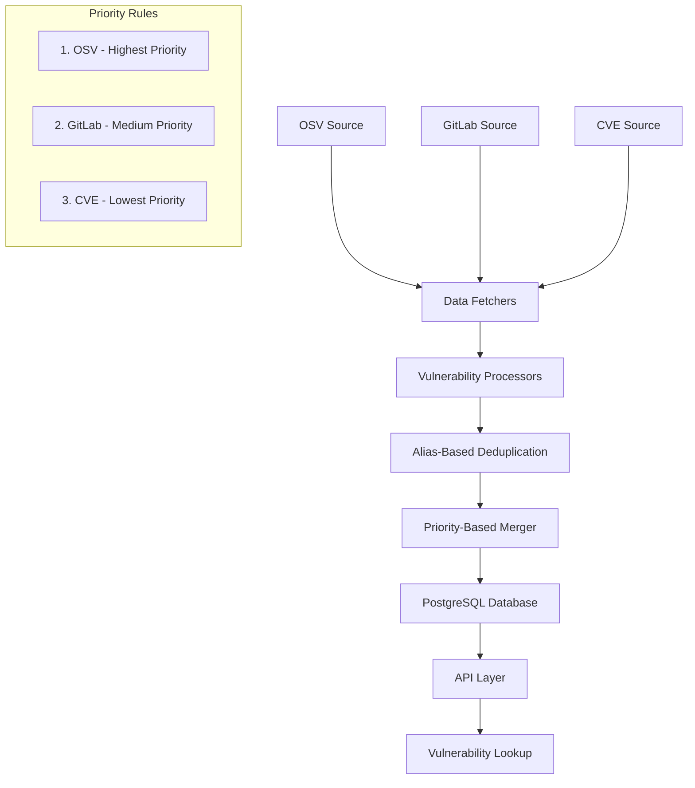
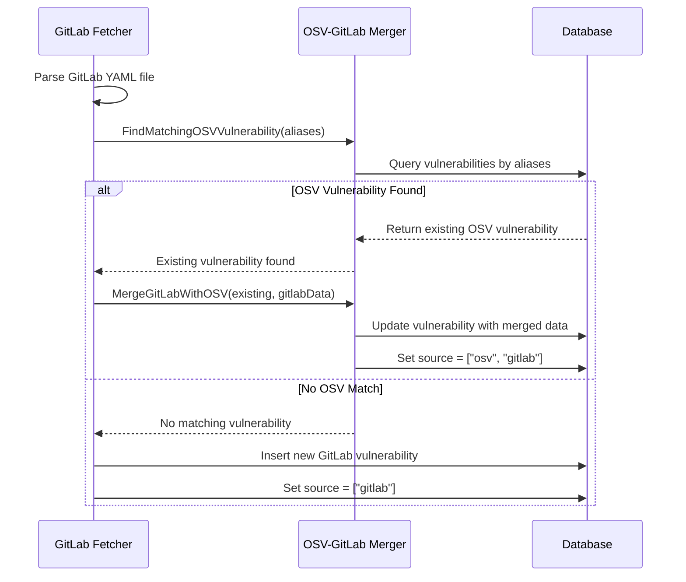

# Vulnerability Data Aggregation and Deduplication Flow

## Executive Summary

This document provides a comprehensive overview of how vulnerability data flows through our ossdeps project, including the aggregation, deduplication, and merging processes across multiple data sources (OSV, GitLab, CVE). The system implements a sophisticated priority-based merging strategy that ensures data quality while avoiding duplication.

---

## 🏗️ Architecture Overview

### High-Level Data Flow



### Core Components

1. **Data Source Fetchers**
   - `OSVFetcher`: Downloads and processes OSV.dev vulnerability data
   - `GitLabFetcher`: Clones and processes GitLab Advisory Database
   - `CVEFetcher`: Downloads and processes CVE Project data

2. **Vulnerability Merger & Deduplicator**
   - `OSVGitLabMerger`: Handles deduplication and merging logic
   - Priority-based merging (OSV > GitLab > CVE)
   - Alias-based deduplication using CVE IDs, GHSA IDs, etc.

3. **Background Processing**
   - Asynq job queue for reliable async processing
   - Worker pools for parallel processing
   - Progress tracking and monitoring

---

## 🔄 Detailed Data Flow Process

### Phase 1: Data Source Ingestion

#### OSV Data Ingestion (Primary Source)
```go
// Location: internal/fetcher/osv/
1. Download all.zip (~657MB) from OSV.dev
2. Extract vulnerability files (JSON format)
3. Process files in parallel (20-50 workers)
4. Parse OSV schema format
5. Insert vulnerabilities with source="osv"
6. Store aliases (CVE, GHSA, PYSEC, etc.)
```

**Key Characteristics:**
- **Priority**: Highest (most comprehensive, well-structured)
- **Format**: OSV JSON schema
- **Volume**: ~296,370 vulnerability files
- **Update Frequency**: Daily

#### GitLab Data Ingestion (Secondary Source)
```go
// Location: internal/fetcher/gitlab/
1. Clone/update gemnasium-db repository
2. Process YAML advisory files
3. Parse GitLab advisory format
4. Convert to OSV-compatible format
5. Check for existing OSV vulnerabilities by alias
6. Merge with OSV if match found, else create new
```

**Key Characteristics:**
- **Priority**: Medium (curated security advisories)
- **Format**: YAML advisory files
- **Processing**: Alias-based deduplication against OSV
- **Source Tracking**: "gitlab" or "osv+gitlab" if merged

#### CVE Data Ingestion (Supplementary Source)
```go
// Location: internal/fetcher/cve/
1. Download CVE Project repository
2. Process CVE 5.0 JSON format files
3. Filter by state (PUBLISHED only)
4. Check for existing vulnerabilities by CVE ID
5. Skip if higher-priority data exists
6. Insert only if no OSV/GitLab data found
```

**Key Characteristics:**
- **Priority**: Lowest (raw vulnerability data, often incomplete)
- **Format**: CVE 5.0 JSON
- **Processing**: Supplements existing data, never overrides
- **Filter**: Only PUBLISHED CVEs (skip DRAFT/REJECTED)

---

## 🎯 Deduplication Strategy

### Alias-Based Matching

The system uses vulnerability aliases to identify duplicate entries across sources:

```go
// Common alias formats
- CVE-YYYY-NNNN (e.g., CVE-2023-12345)
- GHSA-xxxx-xxxx-xxxx (GitHub Security Advisory)
- PYSEC-YYYY-NNNNN (Python Security Advisory)
- GMS-YYYY-NNNNN (GitLab Advisory ID)
```

#### Deduplication Process Flow



### Priority-Based Merging Rules

```go
const (
    PriorityOSV     = 1  // Highest: Comprehensive, well-structured
    PriorityGitLab  = 2  // Medium: Curated advisories  
    PriorityCVE     = 3  // Lowest: Raw vulnerability data
)

// Merging rules:
// 1. OSV data always preserved as primary
// 2. GitLab supplements OSV when aliases match
// 3. CVE supplements only when no higher priority data exists
// 4. Source tracking: ["osv"], ["gitlab"], ["osv", "gitlab"]
```

---

## 📋 Detailed Processing Workflow

### Step 1: OSV Vulnerability Processing

```go
// File: internal/fetcher/osv/service.go
func (s *Service) ProcessOSVFile(ctx context.Context, filePath string) error {
    // 1. Read and parse OSV JSON file
    vulnerability, err := parseOSVFile(filePath)
    
    // 2. Calculate data hash for change detection
    dataHash := calculateVulnerabilityHash(vulnerability)
    
    // 3. Check for existing vulnerability by hash
    existing, err := s.db.GetVulnerabilityByHash(ctx, dataHash)
    if existing != nil {
        return nil // Skip if identical data already exists
    }
    
    // 4. Insert new OSV vulnerability
    return s.db.InsertVulnerability(ctx, vulnerability)
}
```

### Step 2: GitLab Vulnerability Processing

```go
// File: internal/fetcher/gitlab/gitlab.go
func (f *GitLabFetcher) ingestVulnerability(ctx context.Context, parsedVuln *Vuln, rawData map[string]interface{}) error {
    // 1. Check for existing OSV vulnerability with matching aliases
    existingVuln, err := f.merger.FindMatchingOSVVulnerability(ctx, parsedVuln.Aliases)
    
    if existingVuln != nil {
        // 2a. OSV match found - merge GitLab data
        log.Info().
            Str("gitlab_id", parsedVuln.ID).
            Str("osv_id", existingVuln.ID).
            Msg("merging GitLab advisory with existing OSV vulnerability")
            
        gitlabData := &merger.GitLabVulnData{
            ID:               parsedVuln.ID,
            Summary:          parsedVuln.Summary,
            Details:          parsedVuln.Details,
            Aliases:          parsedVuln.Aliases,
            // ... other fields
        }
        
        return f.merger.MergeGitLabWithOSV(ctx, existingVuln, gitlabData)
    }
    
    // 2b. No OSV match - check for GitLab duplicates
    for _, alias := range parsedVuln.Aliases {
        existing, err := f.db.GetVulnerabilityByAlias(ctx, alias)
        if err == nil && isGitLabSource(existing.Source) {
            log.Info().Msg("skipping duplicate GitLab vulnerability")
            return nil
        }
    }
    
    // 3. Insert as new GitLab vulnerability
    return f.insertGitLabVulnerability(ctx, parsedVuln, rawData)
}
```

### Step 3: Vulnerability Merging Process

```go
// File: internal/fetcher/merger/osv_gitlab_merger.go
func (m *OSVGitLabMerger) MergeGitLabWithOSV(ctx context.Context, existing *db.Vulnerability, gitlabData *GitLabVulnData) error {
    // 1. Merge aliases (avoid duplicates)
    allAliases := existing.Aliases
    for _, alias := range gitlabData.Aliases {
        if !containsString(existing.Aliases, alias) {
            allAliases = append(allAliases, alias)
        }
    }
    
    // 2. Update vulnerability with merged data
    // IMPORTANT: Always preserve OSV fields as primary
    _, err := m.db.UpdateVulnerability(ctx, db.UpdateVulnerabilityParams{
        ID:               existing.ID,                  // Keep OSV ID
        Summary:          existing.Summary,             // Keep OSV summary
        Details:          existing.Details,             // Keep OSV details
        Severity:         existing.Severity,            // Keep OSV severity
        PublishedAt:      existing.PublishedAt,         // Keep OSV dates
        ModifiedAt:       pgtype.Timestamp{Time: time.Now(), Valid: true},
        Source:           mustMarshalJSON([]string{"osv", "gitlab"}), // Mark as merged
        Ecosystem:        existing.Ecosystem,           // Keep OSV ecosystem
        PackageName:      existing.PackageName,         // Keep OSV package
        AffectedVersions: existing.AffectedVersions,    // Keep OSV versions
        FixedVersions:    existing.FixedVersions,       // Keep OSV versions
        Aliases:          allAliases,                   // Merged aliases
        Refs:             existing.Refs,               // Keep OSV refs
        Raw:              existing.Raw,                // Keep OSV raw data
        DataHash:         existing.DataHash,           // Keep OSV hash
    })
    
    log.Info().
        Str("osv_id", existing.ID).
        Str("gitlab_id", gitlabData.ID).
        Int("merged_aliases", len(allAliases)).
        Msg("successfully merged GitLab vulnerability with OSV vulnerability")
        
    return err
}
```

### Step 4: CVE Processing (Supplementary)

```go
// File: internal/fetcher/cve/cve.go
func (f *CVEFetcher) processCVE(ctx context.Context, vuln *Vuln, rawData map[string]interface{}) error {
    // 1. Check for existing vulnerability by CVE ID
    existingVuln, err := f.merger.FindMatchingOSVVulnerability(ctx, vuln.Aliases)
    
    if existingVuln != nil {
        // 2. Skip CVE if higher-priority data exists
        log.Info().
            Str("cve_id", vuln.Aliases[0]).
            Str("existing_id", existingVuln.ID).
            Msg("CVE data found existing vulnerability, skipping to avoid duplication")
        return nil
    }
    
    // 3. Insert CVE only if no OSV/GitLab data exists
    return f.insertCVEVulnerability(ctx, vuln, rawData)
}
```

---

## 🗄️ Database Schema & Storage

### Vulnerability Table Structure

```sql
CREATE TABLE vulnerabilities (
    id                  TEXT PRIMARY KEY,
    summary             TEXT NOT NULL,
    details             TEXT,
    severity            TEXT,
    published_at        TIMESTAMP,
    modified_at         TIMESTAMP,
    ecosystem           TEXT,
    package_name        TEXT,
    affected_versions   TEXT[], 
    fixed_versions      TEXT[],
    aliases             TEXT[],           -- Critical for deduplication
    refs                JSONB,            -- Reference URLs
    source              JSONB,            -- ["osv"], ["gitlab"], ["osv", "gitlab"]
    raw                 JSONB,            -- Original data for audit trail
    data_hash           TEXT,             -- For change detection
    created_at          TIMESTAMP DEFAULT NOW(),
    updated_at          TIMESTAMP DEFAULT NOW()
);

-- Critical indexes for performance
CREATE INDEX CONCURRENTLY idx_vulnerabilities_aliases ON vulnerabilities USING GIN(aliases);
CREATE INDEX CONCURRENTLY idx_vulnerabilities_ecosystem ON vulnerabilities(ecosystem);
CREATE INDEX CONCURRENTLY idx_vulnerabilities_package_name ON vulnerabilities(package_name);
CREATE INDEX CONCURRENTLY idx_vulnerabilities_data_hash ON vulnerabilities(data_hash);
CREATE INDEX CONCURRENTLY idx_vulnerabilities_source ON vulnerabilities USING GIN(source);
```

### Source Tracking

The `source` field tracks the origin and merger status:

```json
// OSV vulnerability only
{"source": ["osv"]}

// GitLab vulnerability only  
{"source": ["gitlab"]}

// Merged OSV + GitLab
{"source": ["osv", "gitlab"]}

// CVE vulnerability only
{"source": ["cve"]}
```

---

## ⚡ Performance Optimizations

### Caching Strategy

```go
// Multi-level caching for alias lookups
type CacheManager struct {
    aliasCache     *sync.Map          // In-memory alias -> vuln_id mapping
    vulnCache      *cache.Cache       // LRU cache for frequently accessed vulns
    redisCache     *redis.Client      // Distributed cache for job results
}

// Cache provides 10-100x performance improvement for deduplication
func (cm *CacheManager) GetVulnerabilityByAlias(alias string) (*Vulnerability, error) {
    // L1: In-memory alias cache (50-100MB typical)
    if vulnID, ok := cm.aliasCache.Load(alias); ok {
        return cm.vulnCache.Get(vulnID.(string))
    }
    
    // L2: Redis cache  
    if cached, err := cm.redisCache.Get(ctx, "vuln:"+alias).Result(); err == nil {
        var vuln Vulnerability
        json.Unmarshal([]byte(cached), &vuln)
        return &vuln, nil
    }
    
    // L3: Database fallback
    return cm.db.GetVulnerabilityByAlias(alias)
}
```

### Batch Processing

```go
// Process vulnerabilities in batches for optimal database performance
type BatchProcessor struct {
    batchSize   int                    // 1000-5000 optimal for PostgreSQL
    batch       []VulnerabilityData
    db          DatabaseService
}

func (b *BatchProcessor) ProcessVulnerabilities(vulnerabilities []VulnerabilityData) error {
    for i := 0; i < len(vulnerabilities); i += b.batchSize {
        end := min(i+b.batchSize, len(vulnerabilities))
        batch := vulnerabilities[i:end]
        
        if err := b.db.BatchInsertVulnerabilities(batch); err != nil {
            return fmt.Errorf("batch insert failed: %w", err)
        }
    }
    return nil
}
```

### Worker Pool Management

```go
// Parallel processing with optimal worker configuration
type WorkerPool struct {
    workers    int           // 20-50 workers for I/O bound operations
    jobs       chan string   // File paths to process
    results    chan Result   // Processing results
}

// Key lessons:
// - 20-50 workers optimal for I/O bound file processing
// - Use buffered channels to prevent blocking
// - Monitor worker pool metrics (queue depth, processing time)
```

---

## 🔍 Change Detection & Hash-Based Deduplication

### Data Hash Calculation

```go
// Efficient change detection using content hashing
func CalculateVulnerabilityHash(rawData map[string]interface{}) string {
    // Exclude metadata fields that change frequently
    filtered := make(map[string]interface{})
    for k, v := range rawData {
        if k != "modified" && k != "lastModified" && k != "_updated" {
            filtered[k] = v
        }
    }
    
    data, _ := json.Marshal(filtered)
    return fmt.Sprintf("%x", sha256.Sum256(data))
}

// Key benefits:
// - O(1) duplicate detection via hash comparison
// - Avoids processing identical content
// - Enables incremental updates
```

---

## 🚀 Background Job Processing

### Asynq Job Configuration

```go
// Robust background processing with Asynq
server := asynq.NewServer(
    asynq.RedisClientOpt{Addr: cfg.RedisAddr},
    asynq.Config{
        Concurrency: 20,  // 20 workers optimal for vulnerability processing
        Queues: map[string]int{
            "critical":     6,  // High priority (manual ingestion)
            "auto-vuln":    3,  // Normal priority (scheduled sync)
            "low":          1,  // Low priority (cleanup, exports)
        },
        Timeout:     4 * time.Hour,  // Long timeout for large datasets
        Retry:       2,              // Retry failed jobs twice
        Unique:      5 * time.Hour,  // Prevent duplicate jobs
    },
)
```

### Job Types

1. **OSV Bulk Sync**: Downloads and processes entire OSV dataset
2. **GitLab Sync**: Clones/updates GitLab advisory repository
3. **CVE Sync**: Downloads and processes CVE Project data
4. **Single File Ingestion**: Processes individual vulnerability files
5. **Cleanup Jobs**: Removes outdated or invalid entries

---

## 🧪 Testing & Validation

### Integration Tests

```http
# Test OSV ingestion
POST http://localhost:8080/ingest/vuln/file
Content-Type: application/json
{
  "source": "osv",
  "file_path": "/test/single-vulnerability.json",
  "async": false
}

# Test GitLab merging with existing OSV
POST http://localhost:8080/ingest/vuln/file
Content-Type: application/json
{
  "source": "gitlab", 
  "file_path": "/test/gitlab-vulnerability.yml",
  "async": false
}

# Verify merged vulnerability
GET http://localhost:8080/api/v1/vulns/TEST-2023-12345
# Should show source: ["osv", "gitlab"]
```

### Bulk Processing Tests

```http
# Test parallel processing of all sources
POST http://localhost:8080/ingest/vuln/auto
Content-Type: application/json
{
  "sources": ["osv", "gitlab", "cve"],
  "async": true
}

# Monitor job progress
GET http://localhost:8080/api/v1/jobs/status

# Check vulnerability statistics
GET http://localhost:8080/stats
```

---

## 📊 Monitoring & Observability

### Key Metrics

```go
type Metrics struct {
    // Processing metrics
    VulnerabilitiesProcessed prometheus.Counter
    ProcessingDuration      prometheus.Histogram
    ProcessingErrors        prometheus.Counter
    
    // Data source metrics
    OSVVulnerabilities      prometheus.Gauge
    GitLabVulnerabilities   prometheus.Gauge
    CVEVulnerabilities      prometheus.Gauge
    MergedVulnerabilities   prometheus.Gauge
    
    // Deduplication metrics
    SuccessfulMerges        prometheus.Counter
    SkippedDuplicates      prometheus.Counter
    
    // Performance metrics
    CacheHitRate           prometheus.Gauge
    DatabaseConnections    prometheus.Gauge
    WorkerQueueDepth       prometheus.Gauge
}
```

### Structured Logging

```go
// Comprehensive logging for debugging and monitoring
log.Info().
    Str("vuln_id", vuln.ID).
    Str("source", vuln.Source).
    Strs("aliases", vuln.Aliases).
    Str("ecosystem", vuln.Ecosystem).
    Dur("duration", processingTime).
    Msg("Successfully processed vulnerability")

// Log merge operations
log.Info().
    Str("osv_id", existing.ID).
    Str("gitlab_id", gitlabData.ID).
    Int("merged_aliases", len(allAliases)).
    Msg("Successfully merged GitLab vulnerability with OSV vulnerability")
```

---

## 🚨 Error Handling & Resilience

### Graceful Error Recovery

```go
// Retry logic with exponential backoff
func (vp *VulnerabilityProcessor) ProcessWithRetry(ctx context.Context, vuln *Vulnerability) error {
    for attempt := 0; attempt < maxRetries; attempt++ {
        if err := vp.process(ctx, vuln); err != nil {
            if IsRetryable(err) {
                delay := time.Duration(attempt+1) * baseDelay
                time.Sleep(delay)
                continue
            }
            return err // Non-retryable error
        }
        return nil // Success
    }
    return fmt.Errorf("max retries exceeded")
}
```

### Input Validation

```go
// Comprehensive input validation
func ValidateVulnerability(vuln *Vulnerability) error {
    if vuln.ID == "" {
        return fmt.Errorf("vulnerability ID is required")
    }
    
    // Normalize and validate aliases
    vuln.Aliases = normalizeAliases(vuln.Aliases)
    for _, alias := range vuln.Aliases {
        if !isValidAlias(alias) {
            return fmt.Errorf("invalid alias format: %s", alias)
        }
    }
    
    return nil
}
```

---

## 🎯 Key Success Factors

### Data Quality Assurance

1. **Priority-Based Merging**: Clear hierarchy (OSV > GitLab > CVE)
2. **Alias Normalization**: Consistent format handling across sources
3. **Change Detection**: Hash-based duplicate prevention
4. **Source Tracking**: Audit trail for data provenance

### Performance Optimization

1. **Multi-Level Caching**: Dramatic performance improvement for lookups
2. **Batch Processing**: Optimal database operation patterns
3. **Worker Pools**: Parallel processing for I/O bound operations
4. **Streaming**: Memory-efficient processing of large datasets

### Operational Excellence

1. **Background Jobs**: Reliable async processing with Asynq
2. **Comprehensive Monitoring**: Metrics and structured logging
3. **Health Checks**: System and dependency monitoring
4. **Graceful Shutdown**: Proper cleanup and state preservation

---

## 📋 API Endpoints

### Vulnerability Lookup

```http
# Get vulnerability by ID
GET /api/v1/vulns/{id}

# Get vulnerability by alias (CVE, GHSA, etc.)
GET /api/v1/vulns/alias/{alias}

# Search vulnerabilities by package
GET /api/v1/vulns/search?ecosystem={ecosystem}&package={package}
```

### Ingestion Control

```http
# Single file ingestion
POST /ingest/vuln/file
{
  "source": "osv|gitlab|cve",
  "file_path": "/path/to/file",
  "async": true|false
}

# Bulk ingestion
POST /ingest/vuln/auto
{
  "sources": ["osv", "gitlab", "cve"],
  "async": true
}

# Job status monitoring
GET /api/v1/jobs/status
```

---

## 🔄 Continuous Improvement

### Future Enhancements

1. **Real-Time Sync**: WebSocket/streaming updates from sources
2. **ML-Based Deduplication**: Advanced matching beyond aliases
3. **Automated Quality Scoring**: Confidence levels for data sources
4. **GraphQL API**: More flexible vulnerability querying
5. **Export Formats**: SBOM, SPDX, CycloneDX support

### Monitoring & Alerting

1. **Processing Lag**: Alert on delayed sync operations
2. **Error Rates**: Monitor failure rates by source
3. **Data Quality**: Track merge success rates
4. **Performance**: Database query performance monitoring

---

This comprehensive flow ensures robust, efficient, and reliable vulnerability data aggregation across multiple sources while maintaining data quality and preventing duplication through sophisticated merging strategies.
